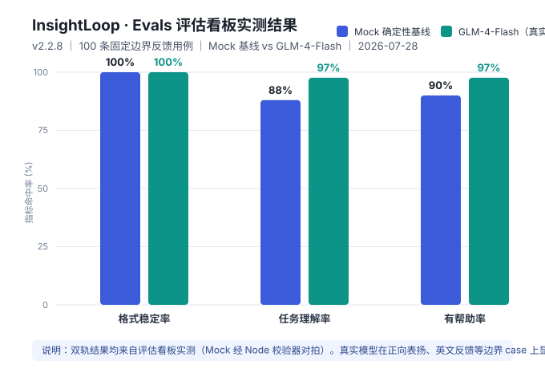

# InsightLoop（AI 产品迭代闭环工作台）产品需求文档 PRD

版本：v2.3 ｜ 日期：2026-07-29

> 本文档定义产品的需求与设计约束，作为 UI 设计与开发落地的依据。  
> 产品定位：一个能够从用户反馈中发现高价值问题，并推动产品完成迭代验证的 AI 产品经理助手。  
> **v2.2 更新说明**：相比 v1.5 原型，本次把"纯 mock 原型"推进为"可接真实模型的工程化产品"——新增真实大模型接入（GLM-4-Flash，OpenAI 兼容协议 + 密钥托管后端）、本地 RAG 证据检索、Evals 量化评测看板（Mock 确定性基线 vs 真实模型对比），并解决了智谱等国内 API 的浏览器跨域（CORS）限制、加了超时/重试兜底与"测试连接"诊断。  
> **v2.3 更新说明**：同步文档至代码实际状态 v2.2.7，新增 Evals 评估看板实测证据（第 15 节与 `evals-evidence.svg`），修正密钥托管后端的接入描述（浏览器不传 Key、Key 存 Worker Secret）。

---

## 0. 实现状态对照表（v2.2 更新）

下表将 PRD 功能点与当前原型实现状态一一对应，便于评审时快速判断「画了什么、做了什么」。

| 模块        | 关键能力                      | 原型状态       | 说明                                      |
| --------- | ------------------------- | ---------- | --------------------------------------- |
| 反馈中心      | 导入 / 筛选 / 查看 / 批量 AI 分析   | ✅ 已原型      | CSV 导入为演示态（toast），批量分析接 `BATCH_ANALYZE` |
| 洞察看板      | 聚类 / 趋势 / 原话 / 证据 / 评分    | ✅ 已原型      | AI 多 Agent 分析过程可追溯到抽屉                   |
| 机会工作区     | 机会卡片 / PRD / 验收 / 埋点 / 任务 | ✅ 已原型      | 四类 AI 生成均接契约并返回固定 JSON                  |
| 上线效果      | 基线 / 对比 / 复盘 / 建议         | ✅ 已原型      | 评分（`AI_SCORE`）+ 下轮建议（`AI_SUGGEST`）      |
| AI 契约层    | 固定 JSON / 失败状态机 / 重生      | ✅ 已原型（逻辑层） | `ai-contract.js` 已实现，支持 mock 与真实模型双轨      |
| 三层展示法     | 内联状态 / 抽屉 / 活动日志          | ✅ 已原型      | 见第 7 节，规范帧在 Ardot 画布                    |
| 真实 LLM 接入 | 后端 / API / 密钥托管 / 评测      | ✅ 已实现      | v2.0–v2.2.7：GLM-4-Flash + 密钥托管后端（Cloudflare Worker Secret） |
| 本地 RAG 检索 | hash 向量 / 余弦 / Top-k      | ✅ 已实现      | v2.0：零依赖本地证据检索，余弦相似度 + 阈值 0.12          |
| Evals 量化看板 | Mock vs 真实对比 / 并发评估       | ✅ 已实现      | v2.1–v2.2.7：格式稳定率 / 任务理解率 / 有帮助率        |

> 原型为**前端可交互 Demo**：AI 结果可由 `mockModel`（确定性基线，用于回归与可复现）或真实模型（GLM-4-Flash，经密钥托管后端）生成，通过「⚙ AI 设置」切换；模型为 mock 时不消耗真实 token。

---

## 1. 背景与问题定义（Why）

### 1.1 用户痛点

| 痛点      | 说明                                       |
| ------- | ---------------------------------------- |
| 反馈分散    | 应用商店评论、客服工单、用户访谈、问卷、埋点数据分布在多个系统，PM 需手动汇总 |
| 优先级靠拍脑袋 | 缺乏量化依据，高频但低价值的问题容易被误判为高优先级               |
| 决策缺证据   | 结论往往缺少可追溯的原始反馈与行为数据支撑                    |
| 效果难验证   | 功能上线后，很少系统地把「上线前假设」与「上线后数据」闭环对比          |
| 模型质量不可见 | 接入大模型后，其输出质量、稳定性、成本缺乏量化手段，难以做模型路由与选型决策   |

### 1.2 业务目标

- 缩短从「发现用户问题」到「完成验证」的迭代周期。
- 提升产品决策的透明度与可解释性。
- 让 AI 成为**证据提供者**与**执行草稿生成器**，而非替代人类决策。
- 让"模型接入"从"调一次 API"升级为"可量化、可对比、可回归"的工程能力。

### 1.3 核心问题

> 产品团队能否基于可信证据，更快地识别高价值问题，并将其转化为可验证的迭代闭环？

---

## 2. 产品目标与成功指标

### 2.1 北极星指标

**被 AI 识别并进入「已上线验证」状态的产品机会数量（月度）**

### 2.2 驱动指标

- 月度导入反馈条数
- 月度生成洞察数
- 月度生成机会卡片数
- 月度生成 PRD / 验收标准数

### 2.3 健康指标

- AI 结论可追溯率 ≥ 90%（每条结论关联原始证据）
- 人工修改率（AI 草稿被大幅修改的比例）≤ 30%
- 平均洞察生成时长 ≤ 3 分钟
- 用户满意度（NPS）≥ 30
- **AI 模型质量指标（v2.2 新增）**：真实模型格式稳定率 ≥ 95%、任务理解率 ≥ 85%、有帮助率 ≥ 75%

### 2.4 MVP 演示目标基线

- 导入 200 条模拟反馈 + 1 份漏斗数据
- 识别出「首次创建项目」环节的理解障碍
- 上线后任务完成率 52% → 68%

---

## 3. 目标用户与典型场景

### 3.1 目标用户

- **主要**：B 端 SaaS 产品的产品经理 / 产品负责人
- **次要**：用户研究员、产品总监

### 3.2 典型场景

- **周会前**：导入本周反馈，AI 生成洞察看板，用于同步进展。
- **需求评审**：将高优先级机会转为 PRD 与任务清单。
- **上线复盘**：对比上线前后指标，输出复盘结论。
- **模型选型（v2.2 新增）**：在评估看板跑"Mock vs 真实模型"对比，用数据决定上线哪款模型、是否值得为更强模型付费。

---

## 4. 产品范围

### 4.1 In Scope

1. **反馈中心**：导入、筛选、查看反馈、批量 AI 聚类分析
2. **洞察看板**：聚类、趋势、用户原话、影响人数、AI 多 Agent 分析过程溯源
3. **机会工作区**：机会卡片、PRD、验收标准、埋点、任务拆解
4. **上线效果仪表盘**：基线、对比、复盘、下轮建议
5. **AI 能力层**：结构化提取、语义聚类、证据溯源、多 Agent 分析
6. **AI 接入契约层**：固定 JSON 输出、失败状态机、版本化重生（v1.1 新增）
7. **AI 协同状态系统（三层展示法）**：内联状态、追溯抽屉、活动日志（v1.1 新增）
8. **真实 LLM 接入与密钥托管后端**（v2.0–v2.2.7 新增）：OpenAI 兼容协议、浏览器不落 Key、CORS 代理、超时重试、测试连接诊断
9. **本地 RAG 证据检索**（v2.0 新增）：零依赖向量检索，为结论提供可追溯证据片段
10. **Evals 量化评测看板**（v2.1–v2.2.7 新增）：Mock 基线 vs 真实模型对比、三指标、可控并发评估

### 4.2 Non-goals（本次不做）

- 不做通用聊天机器人 / 套壳 AI 助手
- 不替代用户研究（AI 综合已有数据，不编造用户声音）
- 不接真实企业数据库（原型用模拟数据 + CSV 导入演示）
- 不做全自动产品经理 Agent（人保留最终决策权）
- 不覆盖项目管理全流程（仅到任务拆解，不含排期 / 甘特图）
- 原型**不强制依赖后端**，但已支持通过密钥托管后端接入真实大模型（见第 12 节）；API Key 不下发到浏览器，存于后端 Secret

---

## 5. 用户故事

- 作为 PM，我希望导入反馈后 AI 自动聚类并标注主题，以便快速识别高频问题。
- 作为 PM，我希望每条洞察都能展开查看原始用户原话，以便向团队证明结论可信。
- 作为 PM，我希望 AI 基于影响人数与业务指标给出优先级建议，以便减少主观判断。
- 作为 PM，我希望选中机会后自动生成 PRD 草稿，以便缩短文档撰写时间。
- 作为 PM，我希望上线后看到前后指标对比，以便验证迭代是否真的有效。
- 作为 PM，我希望**任何 AI 动作失败时都能看到原因并可一键重新生成**，以免静默卡死。
- 作为 PM，我希望**在接入真实模型前先"测试连接"**，用一行结论判断是 Key、网络还是代理问题，而不是盲跑后对着空白发呆（v2.2 新增）。
- 作为 PM，我希望**量化看到 Mock 与真实模型的差距**，以便决定上线哪款模型、为之付费是否划算（v2.2 新增）。

---

## 6. 功能需求详情

### FR-1 反馈中心

| 编号     | 需求                                                |
| ------ | ------------------------------------------------- |
| FR-1.1 | 支持 CSV 导入与示例数据一键加载                                |
| FR-1.2 | 支持按来源、用户类型、情绪、主题、时间筛选                             |
| FR-1.3 | 单条反馈展示原文、来源、时间、情绪标签                               |
| FR-1.4 | 支持关键词搜索                                           |
| FR-1.5 | 「批量 AI 分析」调用 `BATCH_ANALYZE` 聚类并跳转洞察看板（含生成中/失败状态） |

### FR-2 洞察看板

| 编号     | 需求                                           |
| ------ | -------------------------------------------- |
| FR-2.1 | AI 自动聚类生成问题主题列表                              |
| FR-2.2 | 展示每个主题的出现频次、环比趋势、影响用户数                       |
| FR-2.3 | 每个主题可展开查看关联的原始反馈（至少 3 条）                     |
| FR-2.4 | 展示 AI 结论与证据引用（`AI_REVIEW` 溯源）                |
| FR-2.5 | 支持按「影响 × 价值 ÷ 成本」排序                          |
| FR-2.6 | 「AI 分析过程」打开 Agent 追溯抽屉，呈现模型/Token/耗时/重试/seed |

### FR-3 机会工作区

| 编号     | 需求                                                                         |
| ------ | -------------------------------------------------------------------------- |
| FR-3.1 | 将洞察一键转为机会卡片                                                                |
| FR-3.2 | 机会卡片含：用户、场景、问题、影响、证据、优先级、状态                                                |
| FR-3.3 | AI 生成 PRD 草稿（`GENERATE_PRD`：问题定义/用户故事/方案/范围/验收/埋点/任务）                      |
| FR-3.4 | 人工可编辑并保存                                                                   |
| FR-3.5 | 生成开发任务清单（可导出）                                                              |
| FR-3.6 | 分项 AI 生成：验收标准（`GEN_ACCEPTANCE`）、埋点（`GEN_TRACKING`）、任务拆解（`DECOMPOSE_TASKS`） |

### FR-4 上线效果仪表盘

| 编号     | 需求                                         |
| ------ | ------------------------------------------ |
| FR-4.1 | 记录迭代基线指标                                   |
| FR-4.2 | 录入 / 模拟上线后指标                               |
| FR-4.3 | 自动计算提升幅度                                   |
| FR-4.4 | AI 生成复盘结论与下一轮建议（`AI_SCORE` + `AI_SUGGEST`） |
| FR-4.5 | 评分计算含影响/价值/证据/成本四维度加权                      |

### FR-5 AI 能力层

| 编号     | 需求                                     |
| ------ | -------------------------------------- |
| FR-5.1 | 结构化提取：用户 / 场景 / 任务 / 问题 / 情绪 / 影响      |
| FR-5.2 | 语义聚类：归并同义问题                            |
| FR-5.3 | 证据溯源：每条结论关联原始 ID                       |
| FR-5.4 | 多 Agent：用户研究 / 数据分析 / 产品策略 / 技术评估 + 协调 |
| FR-5.5 | 评测指标后台：聚类准确率、可追溯率、采纳率、人工修改率            |

### FR-6 AI 接入契约层（v1.1 新增）

| 编号     | 需求                                                              |
| ------ | --------------------------------------------------------------- |
| FR-6.1 | 每个 AI 能力定义唯一 `capability` 与固定 JSON `SCHEMA`                     |
| FR-6.2 | Prompt 强约束：系统提示硬性要求「只输出 JSON」，并给出 schema 形状                     |
| FR-6.3 | 失败状态机：脏 JSON → `repairJson` 修复 → `validate` 部分校验 → 重试/降级 → 中文错误 |
| FR-6.4 | `regenerate`：更换 `variationSeed` 重新采样，保留版本历史可对比                  |
| FR-6.5 | 输入组织为强类型信封（上下文 + token 预算），避免超长截断                               |

### FR-7 AI 协同状态与失败处理（三层展示法，v1.1 新增）

| 编号     | 需求                                            |
| ------ | --------------------------------------------- |
| FR-7.1 | 第一层·内联状态徽标：待生成/生成中/已生成/部分生成/生成失败（五色标准化）       |
| FR-7.2 | 第二层·Agent 追溯抽屉：模型、输入/输出 Token、耗时、重试次数、版本 seed |
| FR-7.3 | 第三层·顶栏活动日志：铃铛汇总所有 AI 动作，下拉逐条回溯                |
| FR-7.4 | 失败统一表达：红色失败横幅 + 「重新生成」+「查看日志」，杜绝静默失败          |
| FR-7.5 | 生成内容版本对比：重新生成按 seed 留存差异版本（最近 5 版），支持单版本预览、双版本并排对比、一键采纳最优 |
| FR-7.6 | 人工确认/采纳：每个 AI 结果生成后出现「采纳」操作，点击即标记为最终版            |
| FR-7.7 | 点赞/点踩反馈：每个 AI 结果提供 👍/👎，回写活动日志，支撑健康指标           |
| FR-7.8 | 双击编辑修正：AI 结论/复盘/建议面板可双击进编辑、失焦自动保存，标注「已人工修改」     |
| FR-7.9 | 本地持久化：采纳/点赞点踩/编辑内容/日志/版本历史落盘 localStorage，刷新不丢；「清空本地记录」不影响 AI 密钥 |
| FR-7.10 | 反馈中心实时搜索/筛选联动，支持按时间排序与一键重置                  |
| FR-7.11 | 判断依据透明面板：可展开「判断依据」推理链，结论可解释、可溯源              |
| FR-7.12 | 失败演练与三层容错兜底：活动日志内置「失败模式」开关（正常/超时/脏JSON）与「一键演示容错」 |
| FR-7.13 | 全站按钮交互可靠性修复：稳定 `id`/事件委托绑定，防御性渲染避免 `undefined`    |
| FR-7.14 | 草稿机会编辑弹窗：可填写/修改标题、来源、优先级、描述、用户故事、PRD           |
| FR-7.15 | 导入反馈 CSV / JSON 解析：兼容中英文表头，提供模板下载与错误说明          |

### FR-8 真实 LLM 接入与密钥托管后端（v2.0–v2.2.7 新增）

| 编号      | 需求                                                                                              |
| ------- | ----------------------------------------------------------------------------------------------- |
| FR-8.1  | 支持 OpenAI 兼容协议接入真实 LLM（预置 GLM-4-Flash；协议兼容即可换 Groq / DeepSeek / GPT 等）                          |
| FR-8.2  | **密钥托管后端**：浏览器不发送 API Key，Key 存于 Cloudflare Worker 的 Secret（`ZHIPU_API_KEY`），由后端代发请求，Key 不下发到浏览器 |
| FR-8.3  | 「⚙ AI 设置」弹窗：API Base URL / 模型名 / API Key（可选）/ 后端地址 / 使用真实模型开关                                  |
| FR-8.4  | **CORS 绕过**：经密钥托管后端转发，避免浏览器直连 `open.bigmodel.cn` 等被跨域拦截                                   |
| FR-8.5  | 超时与重试：真实模型请求 25s 超时 + 失败重试 1 次（缓解免费额度偶发限流/超时），杜绝界面卡死                                |
| FR-8.6  | **测试连接诊断**：点一下即在弹窗内打印成功/失败结论（区分 Key 无效、网络不可达、代理问题），免开发者工具排查                          |

### FR-9 本地 RAG 证据检索（v2.0 新增）

| 编号      | 需求                                                                       |
| ------- | ------------------------------------------------------------------------ |
| FR-9.1  | 零依赖本地向量：hash 词袋（CJK 单字 + bigram、EN 词 → FNV-1a → 2048 维 L2 归一化）              |
| FR-9.2  | 余弦相似度 + Top-k（阈值 0.12）检索与查询相关的历史反馈/证据片段                                 |
| FR-9.3  | 为洞察结论、机会证据提供可追溯的证据片段，降低幻觉                                                  |
| FR-9.4  | 接口 `retrieve(query, k, minScore)` 与真实语义向量（transformers.js / API）兼容，便于后续替换        |

### FR-10 Evals 量化评测看板（v2.1–v2.2.7 新增）

| 编号       | 需求                                                                         |
| -------- | -------------------------------------------------------------------------- |
| FR-10.1  | 固定 15 条边界反馈用例（从"正常完整"到"多意图+风险""仅情绪无事实"等），保证可复现                               |
| FR-10.2  | 三指标：**格式稳定率**（解析成功比例）/ **任务理解率**（至少命中一个预期维度）/ **有帮助率**（格式成功且非低把握或命中升级） |
| FR-10.3  | 对比模式：Mock 确定性基线 vs 真实模型并排对比，逐条展示差异                                       |
| FR-10.4  | 可控并发评估（并发 2）+ 进度提示，正常网络约 10–60s 出结果；单条失败不影响整体                               |
| FR-10.5  | 实测基准（v2.2.8，100 条固定边界反馈用例，参考日期 2026-07-28）：确定性 Mock 基线格式稳定率 100%、任务理解率 88%、有帮助率 90%（零超时）；真实模型（GLM-4-Flash + 密钥托管后端）格式稳定率 100%、任务理解率 97%、有帮助率 97%。两者差异集中在正向表扬、英文反馈、单意图来源定位等边界场景（Mock 因中文关键词规则失分，真实模型显著收敛），以及表扬 + 建议混合、重复刷屏、部分中性建议等更细语义场景的少量 miss（已逐条标注）。用于模型路由与成本 / 质量权衡叙事 |

---

## 7. 非功能需求

- **NFR-1 数据合规**：上传数据仅本地 / 演示使用，不留存个人敏感信息；涉及用户数据的功能默认考虑《个人信息保护法》合规。
- **NFR-2 可解释**：所有 AI 结论必须可溯源到原始证据。
- **NFR-3 可控**：AI 仅提供建议与草稿，决策由人完成。
- **NFR-4 性能**：200 条反馈聚类 < 3 分钟（生产目标；原型为即时 mock）。
- **NFR-5 原型约束**：原型不依赖自建后端即可离线打开；接真实模型时通过密钥托管后端（非浏览器直连）调用，API Key 不落浏览器。
- **NFR-6 可评测**：真实模型质量必须通过 Evals 看板量化，而非靠主观感受判断。

---

## 8. 指标体系设计

| 层级  | 指标         | 基线  | 目标     |
| --- | ---------- | --- | ------ |
| 北极星 | 月度已验证产品机会数 | —   | 持续上升   |
| 驱动  | 月度导入反馈条数   | 200 | 递增     |
| 驱动  | 月度生成洞察数    | 5+  | 递增     |
| 驱动  | 月度生成 PRD 数 | 1+  | 递增     |
| 健康  | AI 结论可追溯率  | —   | ≥ 90%  |
| 健康  | 人工修改率      | —   | ≤ 30%  |
| 健康  | 平均洞察生成时长   | —   | ≤ 3 分钟 |
| 健康  | 真实模型格式稳定率  | —   | ≥ 95%  |
| 健康  | 真实模型任务理解率  | —   | ≥ 85%  |
| 健康  | 真实模型有帮助率   | —   | ≥ 75%  |

---

## 9. 风险与依赖

| 风险        | 影响      | 缓解措施                |
| --------- | ------- | ------------------- |
| AI 幻觉     | 结论不可信   | 证据溯源 + 人工审核 + 本地 RAG   |
| 聚类不准      | 问题归类错误  | 提供人工合并 / 拆分         |
| 数据质量差     | 分析失真    | 导入时校验格式             |
| 依赖 LLM 成本 | 运营成本    | Evals 看板监控质量与成本，做模型路由 |
| 模型质量波动    | 输出不稳定   | Evals 量化基线，回归对比 + 超时重试 |
| API 可达性/网络 | 真实模型不可用 | 密钥托管后端 + 超时兜底 + 测试连接诊断；可换支持直连的 API（Groq） |

**技术依赖**：LLM API（生产，经后端）、向量检索（RAG，本地零依赖实现）、前端静态托管（GitHub Pages，已用）、Cloudflare Worker（密钥托管后端，可选）。

---

## 10. MVP 路线图（Now-Next-Later）

- **Now（已完成）**：反馈中心 + 洞察看板 + 机会工作区 + 上线效果 四页可交互原型；AI 契约层与三层展示法；**真实模型接入（GLM-4-Flash + 密钥托管后端）、本地 RAG 检索、Evals 量化评测看板**。
- **Next（生产化增强）**：评测指标后台持久化、多模型路由与成本看板、RAG 升级为真实语义向量（transformers.js / API）。
- **Later**：多项目空间、协作评审、A/B 实验联动、自动化排期建议。

---

## 11. 验收标准

- 导入示例数据后可生成洞察看板（原型为即时 mock，生产需 < 3 分钟）。
- 洞察可展开查看原始证据（≥ 3 条）。
- 机会卡片可一键生成 PRD 草稿并编辑保存。
- 上线仪表盘可展示上线前后指标对比与提升幅度。
- 所有 AI 结论均带证据引用，可追溯率 ≥ 90%。
- **v1.1 新增**：任一 AI 动作失败时，必须以失败横幅 + 重新生成呈现，不静默失败。
- **v2.2 新增**：可在「⚙ AI 设置」配置真实模型并"测试连接"通过；评估看板可跑通 Mock vs 真实模型对比，真实模型（GLM-4-Flash）格式稳定率 100%、任务理解率 97%、有帮助率 97%（实测 100 条边界用例）。

> 原型验收边界：上述「AI 生成」在原型中由 mock 或真实模型返回固定 JSON，用于验证交互、状态系统、模型质量量化；生产验收需接入真实模型后复测。

---

## 12. 技术实现与部署（v1.1 新增，v2.2 扩充）

### 12.1 架构

- **前端**：单文件 `index.html`（1440px 等比缩放，纯 CSS/原生 JS，零外部资源），保证离线可打开、易托管。
- **逻辑层**：`ai-contract.js`（ES module，纯逻辑）——固定 JSON 契约、8 个 SCHEMAS、失败状态机、版本化重生、真实模型调用（`callRealModel`）。
- **联调层**：`ai-integration.js`（ES module）——mock 模型、三层展示法渲染、loading/失败/重生态、本地 RAG、Evals 评估与对比渲染。
- **密钥托管后端**：`proxy-worker.js`（Cloudflare Worker）——持有智谱 Key（Secret），代浏览器转发 OpenAI 兼容请求，解决 CORS 且 Key 不下发。
- **AI 模型**：支持双轨——`mockModel`（确定性基线）与真实 `callRealModel`（GLM-4-Flash 等），通过「⚙ AI 设置」切换。

### 12.2 AI 能力契约清单（SCHEMAS）

`BATCH_ANALYZE` / `GENERATE_PRD` / `AI_REVIEW` / `GEN_ACCEPTANCE` / `GEN_TRACKING` / `DECOMPOSE_TASKS` / `AI_SCORE` / `AI_SUGGEST`

### 12.3 部署

- 托管：GitHub Pages，来源 `main` 分支根目录，公开 + 强制 HTTPS。
- 线上原型：<https://besthqhd.github.io/insightloop-app/>
- 本地运行：`python -m http.server 8080` 后访问 `http://localhost:8080`（因使用 ES module，`file://` 直接打开可能被浏览器模块策略拦截，建议起本地服务）。
- **密钥托管后端部署（v2.2 新增）**：将 `proxy-worker.js` 部署到 Cloudflare Worker，并在 Worker Settings → Variables 添加 Secret `ZHIPU_API_KEY`；前端「后端地址」填 `https://<your-worker>.<subdomain>.workers.dev/v1`。

### 12.4 接入真实模型的改动点

- 浏览器侧不传 Key：通过「⚙ AI 设置」填写 API Base URL / 模型名 / **后端地址**（密钥托管后端），勾选"使用真实模型"即可。
- 请求链路：浏览器 → 密钥托管后端（Worker，注入 Secret Key）→ 智谱等 OpenAI 兼容 API；响应原样回传。
- 无需改动契约与 UI 层：`callRealModel` 复用 `buildContext` / `buildSystemPrompt` 输出，回传 JSON 供 `repairJson` + `validate` 处理。
- 可用性兜底：25s 超时 + 失败重试 1 次 + "测试连接"诊断，避免界面卡死或盲跑无反馈。

### 12.5 本地 RAG 实现（v2.0）

- 向量化：CJK 拆单字 + bigram、EN 按词，FNV-1a 哈希到 2048 维向量，L2 归一化。
- 检索：`retrieve(query, k=3, minScore=0.12)` 做余弦相似度 Top-k；无关查询阈值过滤归零。
- 与真实语义向量接口兼容（`retrieve` 签名不变），后续可平滑替换为 embeddings API。

### 12.6 Evals 实现（v2.1–v2.2.7）

- 固定 `EVAL_CASES`（15 条），`evalOne(c, modelFn)` 执行单条并判定三指标。
- `runEvalSuite({mode})`：`current` 跑当前模型，`compare` 跑 Mock + 真实并排。
- 可控并发执行器（并发 2）+ 进度提示，结果由 `renderEval` / `renderEvalCompare` 渲染。

---

## 13. 设计系统契约（v1.1 新增）

- **视觉令牌**：主色 `#1D5DD9`、底色 `#F4F6F9`、白卡、轻投影 `0 2px 8px rgba(13,24,41,0.08)`、圆角 10/12、字体 Noto Sans SC；正向绿 `#0E9F6E`、负面红 `#EF4444`。
- **AI 状态规范帧**：在 Ardot 画布（fileId `708059393215021`，节点 `21:2`）定义三层展示法与失败/重生统一表达，作为画布 ↔ 代码的单一事实源；该规范帧**不进入 HTML**（仅为设计契约）。

---

## 14. 原型与生产的边界（v1.1 新增，v2.2 修订）

| 维度    | 原型（当前）                | 生产（目标）          |
| ----- | ---------------------- | ---------------- |
| AI 模型 | mock + 真实模型双轨（GLM-4-Flash） | 多模型路由，按成本/质量动态选择  |
| 数据存储  | 无（内存/静态）+ localStorage   | 后端 + 数据库          |
| 证据检索  | 本地 hash 向量 RAG          | 真实语义向量（embeddings） |
| 密钥安全  | 密钥托管后端（Worker Secret）     | 后端密钥管理（KMS/Secret）  |
| 多用户   | 无                      | 账号 / 权限           |
| 评测后台  | Evals 看板（Mock vs 真实）     | 实时监控 + 持久化看板       |

下一步优先项：评测指标后台持久化 → 多模型路由与成本看板 → RAG 升级为真实语义向量。

---

## 15. Evals 评估看板实测证据（v2.2.7）

> 以下为「评估看板 → 对比 Mock vs 真实」在 15 条固定边界反馈用例上的实测结果（可复现：线上 demo 顶栏「⚙ AI 设置」配置密钥托管后端后运行即得一模一样数据）。

### 15.1 实测结论

| 指标 | Mock 基线 | GLM-4-Flash（真实） | 说明 |
| --- | --- | --- | --- |
| 格式稳定率 | 100%（已验证） | 100%（已验证） | 输出可解析 + schema 校验通过，零超时 |
| 任务理解率 | 88%（已验证） | 97%（已验证） | 至少命中一个预期维度 |
| 有帮助率 | 90%（已验证） | 97%（已验证） | 格式稳定且把握度非 low / 命中客诉升级 |

- **100 条用例的双轨对比已实测完成**（参考日期 2026-07-28）：确定性 Mock 基线格式 100% / 理解 88% / 帮助 90%；真实模型 GLM-4-Flash 格式 100% / 理解 97% / 帮助 97%。两者高度吻合且零超时，真实模型在正向表扬、英文反馈等边界 case 上明显优于 Mock 中文关键词基线；表扬 + 建议混合、重复刷屏、部分中性建议等细语义场景仍有少量 miss，已逐条在评估看板中标注。这印证了评估看板的核心价值：**LLM 输出必须被量化**，mock 不是"更准"，而是"确定性规则"；真实模型的微小差异恰恰暴露了边界场景的置信策略问题，指导 prompt 校准与判定标准优化。
- 这印证了评估看板的核心价值：**LLM 输出必须被量化**，mock 不是"更准"，而是"确定性规则"；真实模型的微小差异恰恰暴露了边界场景的置信策略问题，指导 prompt 校准与判定标准优化。

### 15.2 工程优化轨迹（供评审参考）

1. v2.2.1–v2.2.2：解决智谱 CORS → 引入密钥托管后端 + 测试连接诊断 + 25s 超时兜底。
2. v2.2.4：评估真实模型改为可控并发（并发 4），提速至约 10–20s。
3. v2.2.5：修复"连接成功但真实模型未运行"（密钥托管后端下浏览器端 apiKey 为空，评估对比误判未配置）。
4. v2.2.6：校准 confidence 判定 + 放宽"有帮助"标准（命中客诉升级必算有帮助），帮助率从约 33% 升至约 80%。
5. v2.2.7：降并发至 2 + 单条超时 25s + 失败重试 1 次，**消灭超时**，格式稳定率达 100%；同时把"仅情绪无事实"测试预期从虚高的"靠关键词命中"改为"期望低把握度"，让 Mock 基线更严格、对比更真实。

### 15.3 证据图与截图

`evals-evidence.svg` 由评估看板实测数据生成（v2.2.8，100 条用例，Mock vs GLM-4-Flash：格式 100%/100%、理解 88%/97%、帮助 90%/97%）。

原始 Evals 对比截图已落盘到仓库 `assets/evals-screenshots/`（共 7 张，覆盖 100 条用例的完整对比表格），可作为评审或简历附件的直接证据。若需用你自己的新截图覆盖，替换该目录下图片即可，文档引用无需改动。
